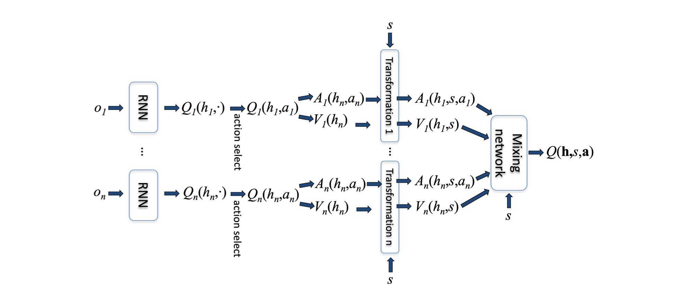

## Introduction
---
This project aims to develop a Deep Reinforcement Learning (DRL) solution to optimize maintenance actions and decision-making in multi-agent systems. Each system is assumed to operate in a decentralized and independent manner, relying solely on its local observation of the environment. The environment consists of three distinct state spaces: Operational, Planned Maintenance, and Corrective Maintenance.

To simulate interactions between agents and their environment, we construct a discrete-time Markov chain using historical data from the equipment. The performance of the proposed DRL network is benchmarked against a baseline Value Iteration Model derived from Dynamic Programming. At a minimum, the DRL approach should produce an optimal policy that matches the performance of the Value Iteration algorithm applied independently to each agent.

## Method
---
The proposed RL approach involves building a value factorization model tailored to a Centralized Training and Decentralized Execution (CTDE) framework. Specifically, we implement the QPLEX model, as illustrated in the image below. Since this project operates on historical data, it is assumed that each agent has full awareness of its current state. Therefore, we will not use Recurrent Neural Networks (RNNs) to capture agent histories. Instead, at the upstream level, Deep Q-Networks (DQNs) will be employed to approximate the Q-values for each agent independently.

Considering the goal is to minimize cost, the objective of the optimization to select actions that minimize the long-run cost of the system.

(Ref: Intro to CTDE for Cooperative Multi-Agent RL - Christopher Amato)

The Value Iteration Algorithm is defined using the Bellman Equation below:

$$
V_n(i) = \min_{a \in A(i)} \left( c_i(a) + \sum_{j \in I} p_{ij}(a)V_{n-1}(j) \right), \quad i \in I
$$

(Ref: Stochastic Modeling and Analysis - Henk Tijms)

### Performance thus far:
---
Click the links below to view current performance using sample markov chains.

https://github.com/mshobanke/Optimal-Decision-Making-for-Mutilagent-Systems/tree/main/implementation%20and%20learning%20dashboard

## Team
1. Mobolaji Shobanke
2. Paul Asamoah
